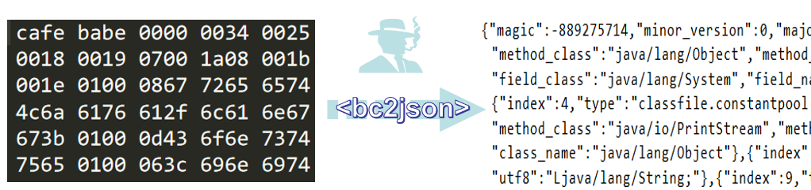

# Java bytecode to JSON representation


[](https://codebeat.co/projects/github-com-racaljk-bc2json-master)
[](https://search.maven.org/search?q=g:%22com.github.racaljk%22%20AND%20a:%22bc2json%22)

**bc2json** could convert `*.class bytecode` to `json` representation so that we can use it as **a human readable and also the world's most popular IR(ok, that's json)** for further use.
Parsing behaviors are based on jvm8 specification. All elements on specification would be parsed into json.

# Quick start
Step 0: Recommend to introduce **bc2json** and its dependencies by maven
```xml
<dependency>
  <groupId>com.github.racaljk</groupId>
  <artifactId>bc2json</artifactId>
  <version>1.1.1/version>
</dependency>
```
Step 1: You can load bytecode from local file
```java
B2Json b2Json = B2Json.fromFilePath("/path/to/Test.class");
```
Optional step 2: and then set some options
```java
b2Json.withOption(Option.PRETTY_PRINTING);
b2Json.withOption(Option.MORE_READABLE);
```
Step 3: Got it
```java
String result = b2Json.toJsonString();
System.out.println(result);
// Or persist the result string to disk
b2Json.toJsonFile("test.json");
```
# Demonstrations of options
You can set these options according to your demands
+ `Without any options` 
```javascript
{"magic":-889275714,"minor_version":0,"major_version":52,"constants":{"slotsNum":"37","slots":[
{"index":1,"type":"parser.classfile.constantpool.ConstantMethodRefInfo","method_class":"java/lang/Object",
"method_name":"\u003cinit\u003e","method_type":"()V"},...]},"access_flag":33,"this_class":"Test",
"super_class":"java/lang/Object","interfaces":[],"fields":[{"field_name":"greeting","field_type":
"Ljava/lang/String;","access_flag":"26"}],"methods":[{"method_name":"\u003cinit\u003e","method_type"
:"()V","method_flag":"1","method_opcode":"42,183,0,1,177"},...],"classfile_attributes":[{"attribute_name":
"SourceFileAttribute","source_file":"Test.java"},...]}
```
+ `Option.PRETTY_PRINTING`
```javascript
{
  "magic": -889275714,
  "minor_version": 0,
  "major_version": 52,
  "constants": {
    "slotsNum": "37",
    "slots": [
      {
        "index": 1,
        "type": "parser.classfile.constantpool.ConstantMethodRefInfo",
        "method_class": "java/lang/Object",
        "method_name": "\u003cinit\u003e",
        "method_type": "()V"
      },
      ...
    ]
  },
  "access_flag": 33,
  "this_class": 26,
  "super_class": 30,
  "interfaces": [],
  "fields": [
    {
      "field_name": "greeting",
      "field_type": "Ljava/lang/String;",
      "access_flag": "26"
    }
  ],
  "methods": [
    {
      "method_name": "\u003cinit\u003e",
      "method_type": "()V",
      "method_flag": "1",
      "method_opcode": "42,183,0,1,177"
    },
    ...
  ],
  "classfile_attributes": [
    {
      "attribute_name": "SourceFileAttribute",
      "source_file": "Test.java"
    },
    ...
  ]
}
```

+ `Option.PRETTY_PRINTING and Option.MORE_READABLE`
```javascript
{
  "magic": "cafebabe",
  "version": "52.0",
  "constants": {
    "slotsNum": "37",
    "slots": [
      {
        "index": 1,
        "type": "parser.classfile.constantpool.ConstantMethodRefInfo",
        "method_class": "java.lang.Object",
        "method": " \u003cinit\u003e()"
      },
      ...
    ]
  },
  "access_flag": "public super ",
  "this_class": "Test",
  "super_class": "java.lang.Object",
  "interfaces": [],
  "fields": [
    {
      "field": "private static final java.lang.String greeting"
    }
  ],
  "methods": [
    {
      "method_signature": "public \u003cinit\u003e()",
      "method_opcode": "aload_0,invokespecial,nop,aconst_null,return"
    },
    ...
  ],
  "classfile_attributes": [
    {
      "attribute_name": "SourceFileAttribute",
      "source_file": "Test.java"
    },
    ...
  ]
}
```

# Documentation
See its `javadoc` for full details.

# License
Yes, I love the [MIT LICENSE](LICENSE)